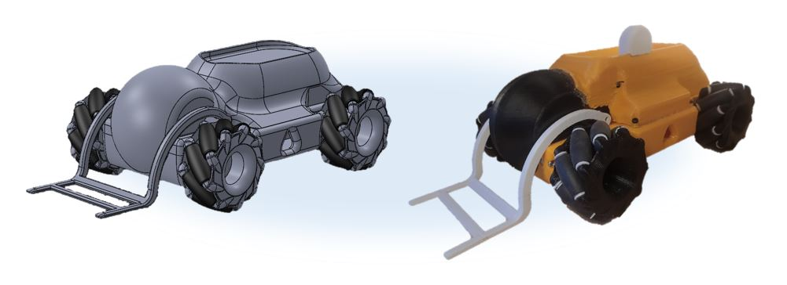
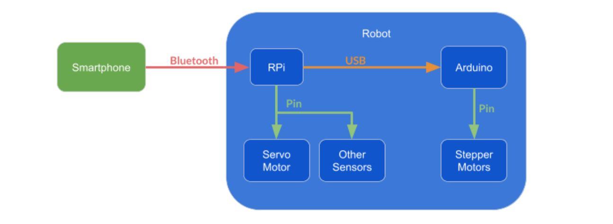
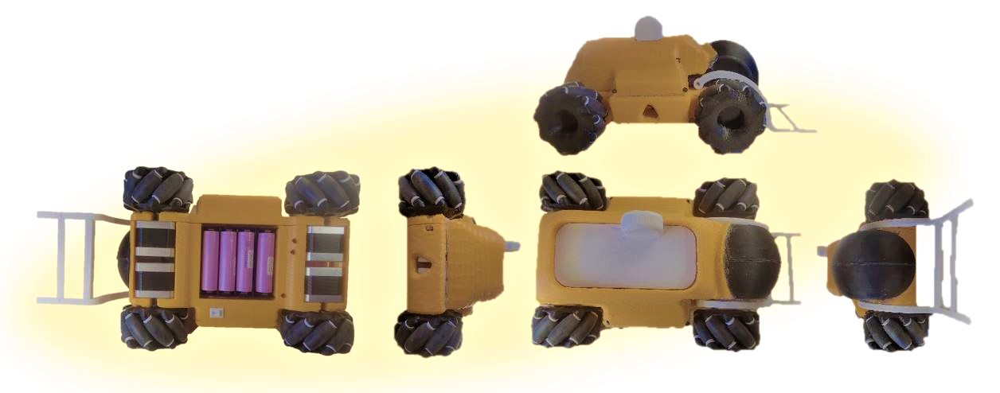
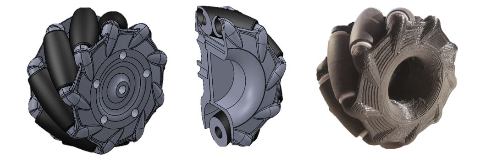
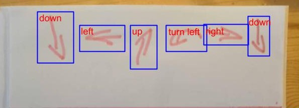

#### System Architecture

The robot embeds common and open source components to be easily made.

The arduino is simply there to control the motors via the RAMPS 1.6, which is the motor shield. As a slave, it responds to a serial command of speed intensity on both translation and rotation possible on the ground. The raspberry is the master and controls all the actuators.

#### Mechanical Design

The robot manufacturing tries to take advandage of 3D printing. This would allow for a greater sharing of the project.

As the project aims to be open source, we try to make the robot fully 3D printable. [Here]("https://github.com/jumellet/ilo-bot/tree/main/parts") can be found the differnet parts.

The Meccanum wheels are the key part of the robot, and enable it to have 3 degrees of liberty on the ground.

#### Elementary Programming

Our goal to introduce algorithm theory from the youngest age. We provide an easy way to learn how to structure computer code and execute it.

Our system has the particularity to allow children to code without a computer. With a pencil and a sheet of paper, you can start to code the robot's movements. The idea is to open the doors of programming as soon as possible and to as many people as possible. Verification the programming of the robot path is done with the application. It is simply a matter of taking a picture and ilo will start its journey.