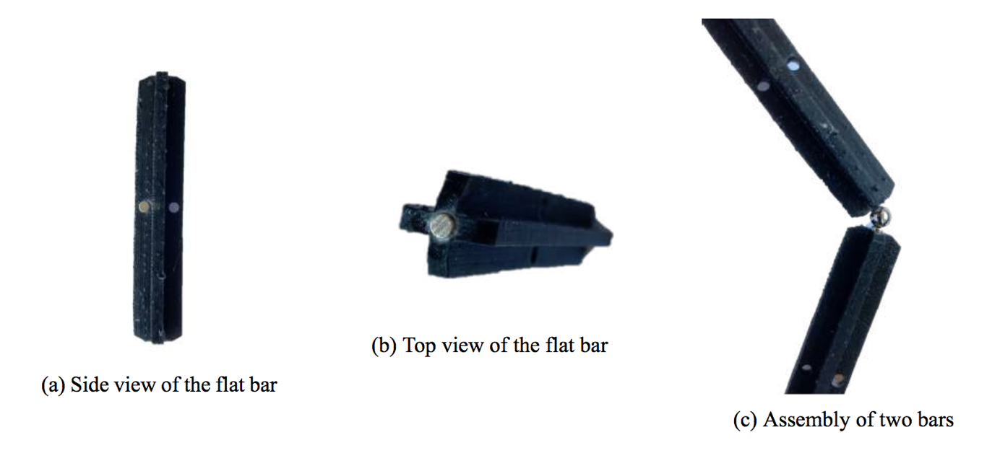
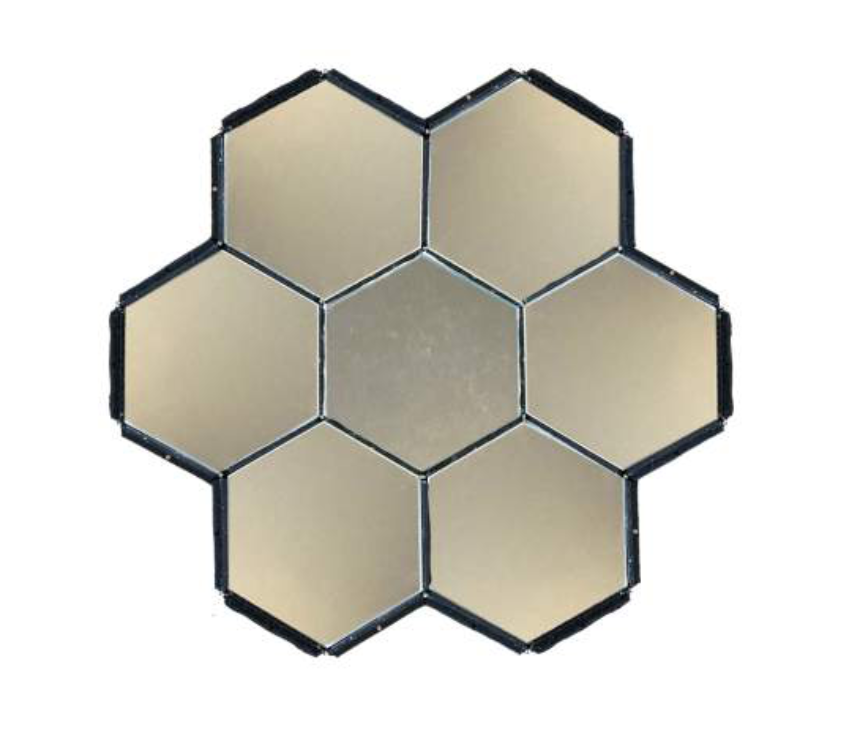
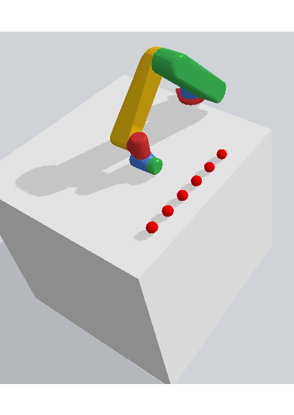

#### Truss Assembly 

The joint at the assembly nodes is a crucial part. For a robotic assembly, it is the part that requires the most advanced techniques, but it could be facilitated with a well engineered process. Different are discussed for the assembly of mirrors and then magnetic joints are presented.

This design ease the assembly for the robot. First, the grasping is made using magnetization so no need for special grasping. There is no lost surface and the bars are lighter which is a very important consideration for an on-­orbit assembly where the payload is very costly. Then because of the symmetry of the bars, the assembly needs to care only about the orientation of the element on the z axis. Finally, this design can easily be printed in space same as the ”Trusselator” which considerably reduces the payload for big structures assembly.

#### Autonomous path planning 

The number of steps is the number of modifications of the joint angle. The DQL showed good results. With this Policy, the robot could find the optimal path to the target with the minimum number of 3 steps. Finally, that technique was kept to make the Pick and Place environment where the robot had to catch a ball with a magnetized end-effector and place it in another desired position. In the end, the robot did it with an average of 5 steps. 

