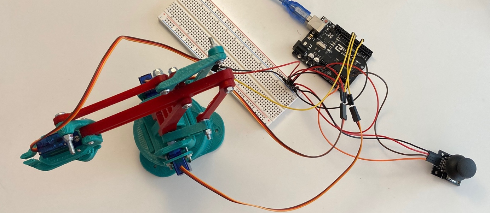
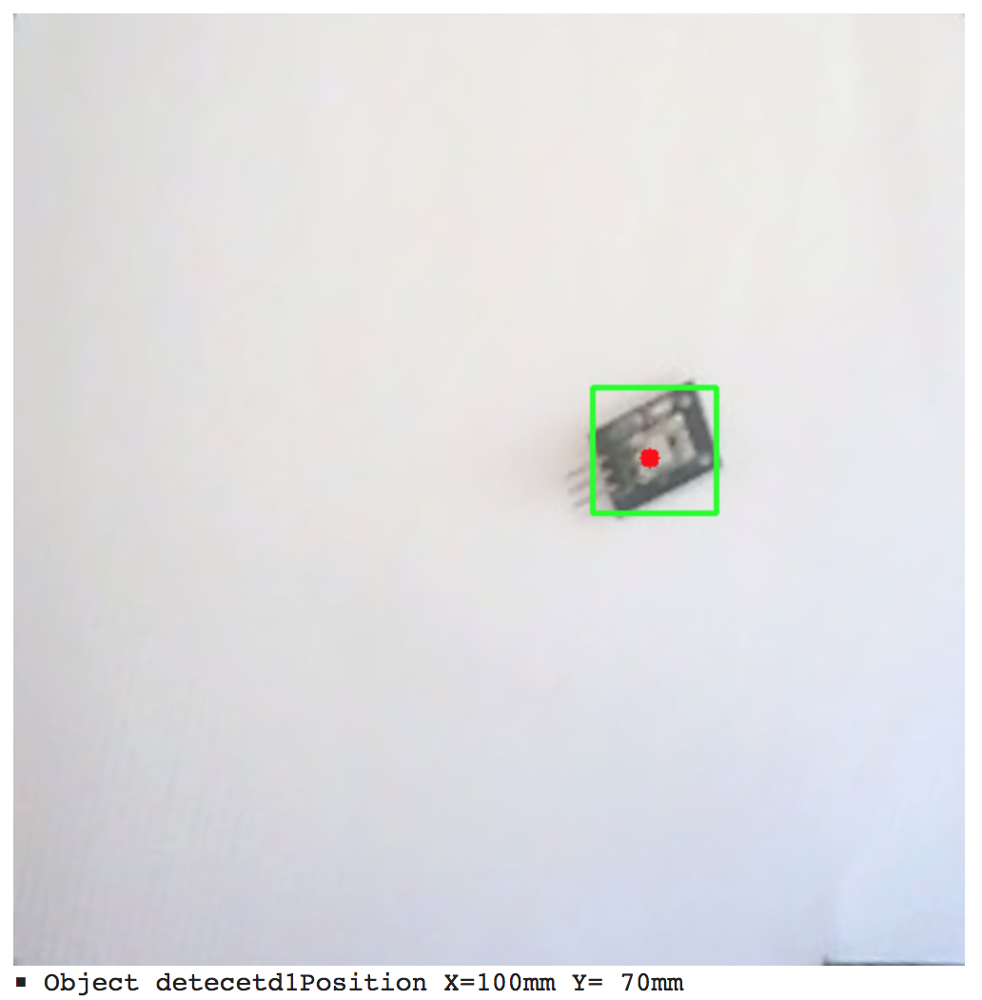

#### Installation

In order to manipulate the MK1 we used an arduino uno and a joystick as you can see on the following picture:

The servos are plugged on the PWN pins 5, 6, 9. And the joystick is plugged on the A0 and A1.

#### Conputer Vision

Steps are described on the github repository [EEZYbotComputerVision]("https://github.com/JorandG/EezybotMK1ComputerVision") so that the user can obtain the postion of an object in a square made with aruco markers as followed:

